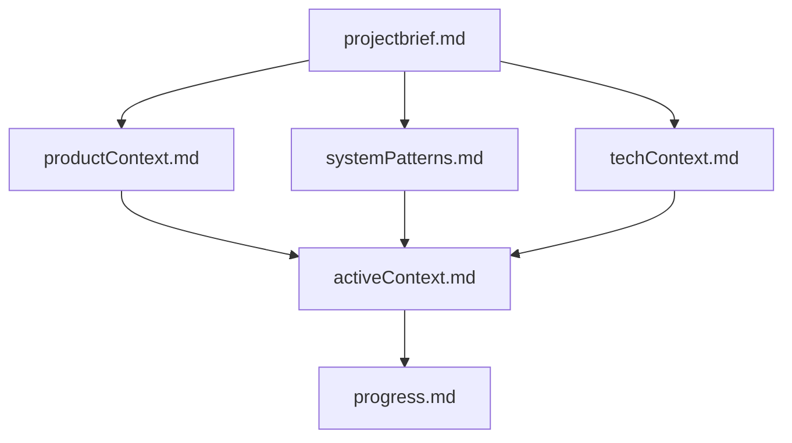

# Memory Bank for Virtual Onvif Server

This Memory Bank contains comprehensive documentation for the Virtual Onvif Server project. It serves as a knowledge repository that captures the project's purpose, architecture, technical details, current status, and future plans.

## Purpose

The Memory Bank is designed to provide a complete understanding of the project, enabling anyone (including future developers) to quickly grasp:
- Why the project exists
- How it's structured
- What technologies it uses
- Current status and progress
- Known issues and challenges
- Future development plans

## Structure

The Memory Bank follows a hierarchical structure where files build upon each other:

### Core Files

1. **projectbrief.md**
   - Foundation document that shapes all other files
   - Defines core requirements and goals
   - Source of truth for project scope

2. **productContext.md**
   - Why this project exists
   - Problems it solves
   - How it should work
   - User experience goals

3. **systemPatterns.md**
   - System architecture
   - Key technical decisions
   - Design patterns in use
   - Component relationships

4. **techContext.md**
   - Technologies used
   - Development setup
   - Technical constraints
   - Dependencies

5. **activeContext.md**
   - Current work focus
   - Recent changes
   - Next steps
   - Active decisions and considerations

6. **progress.md**
   - What works
   - What's left to build
   - Current status
   - Known issues

7. **.clinerules**
   - Project-specific patterns
   - Workflow preferences
   - Critical implementation paths
   - Evolution notes

## Usage

When working on the Virtual Onvif Server project:

1. Start by reviewing the Memory Bank files to understand the project context
2. Refer to specific files when working on related aspects of the project
3. Update the Memory Bank when making significant changes or discoveries
4. Use the .clinerules file for guidance on project-specific patterns and preferences

## Maintenance

The Memory Bank should be updated:
1. After implementing significant changes
2. When discovering new project patterns
3. When clarifying project context
4. When updating project status or progress

Remember that the Memory Bank is a living documentation system that evolves with the project.
