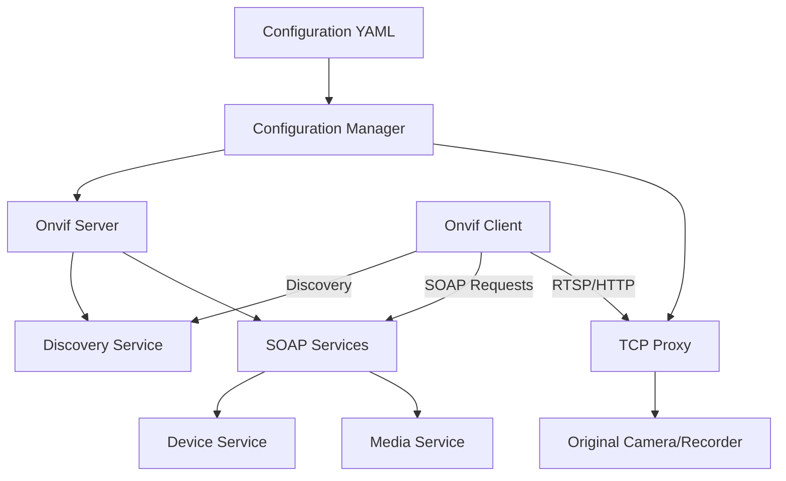

# System Patterns: Virtual Onvif Server

## System Architecture

The Virtual Onvif Server follows a proxy-based architecture with the following key components:

1. **Configuration Manager**: Handles parsing and validation of the YAML configuration file that defines the virtual Onvif devices.

2. **Onvif Server**: Creates and manages virtual Onvif devices based on the configuration, implementing the necessary SOAP services to respond to Onvif protocol requests.

3. **TCP Proxy**: Forwards RTSP and HTTP traffic between clients and the original camera/recorder.

4. **Discovery Service**: Implements the WS-Discovery protocol to make virtual Onvif devices discoverable on the network.

## Key Technical Decisions

1. **Node.js Platform**: The application is built on Node.js for its lightweight footprint, making it suitable for deployment on resource-constrained devices like Raspberry Pi.

2. **SOAP Protocol Implementation**: Uses the 'soap' library to implement the Onvif SOAP services, allowing the virtual devices to respond to standard Onvif protocol requests.

3. **TCP Proxying**: Employs 'node-tcp-proxy' to forward RTSP and HTTP traffic between clients and the original camera/recorder, avoiding the need to transcode video streams.

4. **YAML Configuration**: Uses YAML for configuration files due to its human-readable format and better support for complex nested structures compared to JSON or INI formats.

5. **Virtual Network Interfaces**: Relies on the MacVLAN network driver to create virtual network interfaces with unique MAC addresses, essential for proper identification by Unifi Protect.

6. **Docker Support**: Provides containerization for easier deployment and isolation.

## Design Patterns

1. **Proxy Pattern**: The core of the application acts as a proxy between Onvif clients and the original camera/recorder, intercepting and forwarding requests as needed.

2. **Factory Pattern**: The OnvifServer class acts as a factory for creating virtual Onvif devices based on configuration.

3. **Configuration Object Pattern**: Uses a structured configuration object to define the properties and behavior of virtual devices.

4. **Service Locator Pattern**: The SOAP services are registered and located through a service registry mechanism.

5. **Event-Driven Architecture**: Uses Node.js's event-driven model for handling network communications and discovery events.

## Component Relationships

### Main Application (main.js)
- Parses command-line arguments
- Loads and validates the configuration file
- Creates Onvif servers and TCP proxies based on the configuration
- Handles the configuration creation wizard

### Configuration Builder (config-builder.js)
- Connects to existing Onvif devices to extract stream information
- Generates configuration templates for virtual Onvif devices
- Handles authentication with the original Onvif device

### Onvif Server (onvif-server.js)
- Implements the core Onvif protocol functionality
- Creates HTTP servers for handling SOAP requests
- Implements the Device and Media services
- Manages the WS-Discovery protocol for device discovery
- Serves static resources like snapshot images

### Data Flow

1. **Configuration Phase**:
   - User provides configuration via YAML file or generates it using the configuration tool
   - Application parses configuration and creates virtual Onvif devices

2. **Discovery Phase**:
   - Onvif clients send WS-Discovery probe messages
   - Virtual devices respond with their capabilities and endpoints

3. **Operation Phase**:
   - Clients connect to virtual devices using SOAP requests
   - Virtual devices respond with appropriate information (capabilities, profiles, stream URIs)
   - When clients request video streams, the TCP proxy forwards the traffic to the original source

## Error Handling

- The application includes error handling for common issues like:
  - Configuration file errors
  - Network interface problems
  - Authentication failures with original Onvif devices
  - Time synchronization issues (common with Onvif devices)
