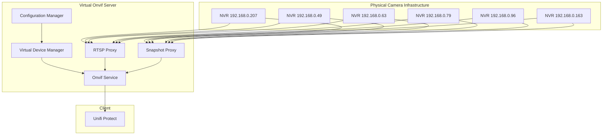

# System Patterns: Virtual Onvif Server

## System Architecture

The Virtual Onvif Server follows a proxy-based architecture that creates virtual representations of physical camera devices. The system is structured around these key components:

### Architecture Overview

## Key Components

### 1. Configuration Manager
- Loads and parses the YAML configuration file
- Validates configuration parameters
- Provides configuration data to other components

### 2. Virtual Device Manager
- Creates and manages virtual Onvif devices
- Assigns unique identifiers (MAC addresses, UUIDs)
- Manages device metadata (name, capabilities)

### 3. Onvif Service
- Implements the Onvif Profile S protocol
- Handles device discovery requests
- Processes media profile requests
- Manages authentication

### 4. RTSP Proxy
- Forwards RTSP stream requests to the actual NVR
- Handles stream negotiation
- Manages stream sessions

### 5. Snapshot Proxy
- Retrieves snapshot images from the NVR
- Caches images when appropriate
- Serves images to clients

## Key Technical Decisions

### 1. Virtual Network Interfaces
The system uses MacVLAN virtual network interfaces to create unique network identities for each virtual camera. This approach:
- Provides each virtual camera with its own MAC address
- Allows proper discovery by Unifi Protect
- Enables simultaneous operation of multiple virtual cameras

### 2. YAML Configuration
The system uses YAML for configuration because:
- It's human-readable and easy to edit
- It supports hierarchical data structures that match the system's needs
- It allows for clear organization of the many parameters needed for each camera

### 3. Node.js Runtime
The system is built on Node.js because:
- It provides excellent asynchronous I/O capabilities for handling multiple streams
- It has good support for network protocols
- It's cross-platform and runs well on Raspberry Pi

### 4. Port Allocation Strategy
Each virtual camera requires multiple ports:
- Server port for Onvif communication
- RTSP port for video streaming
- Snapshot port for still images

The system uses a structured port allocation strategy to avoid conflicts.

## Design Patterns

### 1. Proxy Pattern
The core of the system implements the Proxy pattern, where the virtual Onvif server acts as a proxy for the real NVR cameras. This pattern:
- Presents a consistent interface to clients
- Handles communication details with the real devices
- Adds functionality (like splitting multi-channel devices)

### 2. Factory Pattern
The system uses a factory pattern to create virtual devices based on configuration:
- Centralizes device creation logic
- Ensures consistent device setup
- Simplifies adding new device types

### 3. Adapter Pattern
The system adapts between different protocols and formats:
- Converts between Onvif and native NVR protocols
- Adapts stream formats when necessary
- Bridges different authentication mechanisms

## Component Relationships

### Configuration Flow
1. The configuration file defines NVRs and their cameras
2. For each camera, a virtual device is created
3. Each virtual device is assigned network parameters
4. The virtual devices are registered with the Onvif service

### Request Flow
1. Unifi Protect discovers virtual devices via Onvif
2. Unifi requests stream URLs from virtual devices
3. Virtual devices provide URLs pointing to the RTSP proxy
4. RTSP proxy forwards requests to the real NVR
5. Video streams flow from NVR through proxy to Unifi Protect

### Error Handling
- Network errors are logged and retries are attempted
- Configuration errors are reported with clear messages
- Stream interruptions trigger reconnection attempts

## Scalability Considerations

The current implementation supports 128 cameras across 6 NVRs, demonstrating good scalability. Key factors in the scalability design:

1. **Independent Virtual Devices**: Each virtual device operates independently
2. **Resource Isolation**: Virtual network interfaces provide isolation
3. **Efficient Proxying**: Stream data is proxied without unnecessary processing
4. **Configurable Ports**: Port allocation prevents conflicts in large deployments
